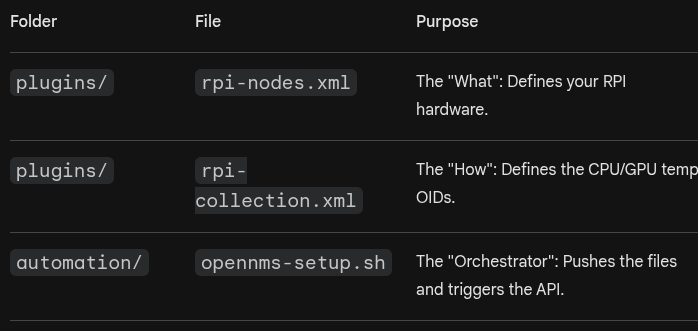

Create a "Provisioning Requisition" XML.
This is a file you can feed to OpenNMS so it automatically adds your Raspberry Pi 
to the dashboard without you having to click through the UI.

In OpenNMS, Provisioning Requisitions are the best way to automate node management. 
Instead of manually adding the Raspberry Pi through the web interface, 
you define it in an XML file (the "Requisition") and "import" it. 
This is exactly how production-grade OpenNMS environments handle thousands of devices.

1. The Requisition File (rpi-nodes.xml)
Create this file in your plugins/ directory. It tells OpenNMS: "Here is a node, use SNMP, and look for these specific services."

Refer to rpi-nodes.xml
<model-import foreign-source="RPI-Lab">
    <node foreign-id="rpi-b-01" node-label="Raspberry-Pi-B">
        <interface ip-addr="192.168.0.38" status="1" snmp-primary="P">
            <monitored-service service-name="ICMP"/>
            <monitored-service service-name="SNMP"/>
        </interface>
        <category name="RaspberryPi"/>
        <category name="Laboratory"/>
    </node>
</model-import>

2. Automating the Import (Goal 1 Integration)
You can use the OpenNMS REST API to push this file into the system. This should be added to your automation/opennms-setup.sh script so the lab is fully populated upon startup.

Add this to your setup script:

Bash
# 1. Post the requisition to the OpenNMS API
curl -u admin:admin -X POST -H "Content-Type: application/xml" \
     -d @../../../plugins/rpi-nodes.xml \
     http://localhost:8980/opennms/rest/requisitions

# 2. Tell OpenNMS to "Synchronize" (actually start discovery)
curl -u admin:admin -X PUT \
     http://localhost:8980/opennms/rest/requisitions/RPI-Lab/import
3. Verification: The "Event Bus"
Once you run the import, OpenNMS will fire several events. You can watch these in the real-time console or via logs to see the "Logic" in action:

uei.opennms.org/internal/importer/importStarted: OpenNMS read your XML.

uei.opennms.org/nodes/nodeAdded: The Raspberry Pi is now in the database.

uei.opennms.org/nodes/snmpConfigConfirmed: OpenNMS successfully talked to your snmpd on the Pi.

📂 Your Updated Lab Structure
Your education-focused structure now looks like this:

